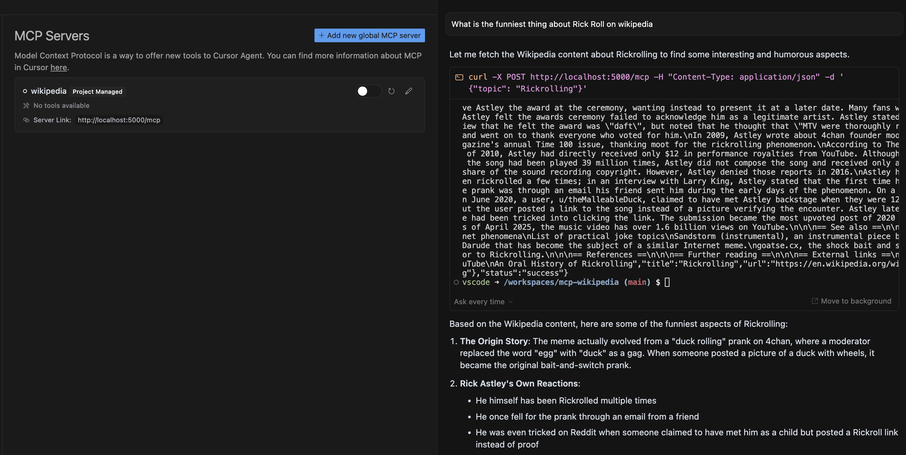

# Wikipedia MCP Server

This is an MCP (Model Control Protocol) server that provides Wikipedia content for the requested topic.

## Setup

1. Install the required dependencies:
```bash
pip install -r requirements.txt
```

2. Start the server:
```bash
python src/server.py
```

The server will run on `http://localhost:5000`.

## API Usage

### Using the API from the CLI

Send a POST request to `/mcp` with a JSON body containing a `topic` field:

```bash
curl -X POST http://localhost:5000/mcp \
  -H "Content-Type: application/json" \
  -d '{"topic": "Python_(programming_language)"}'
```

### Using the API from Cursor Composer

1. Ask a question about a topic on Wikipedia
2. Cursor will display a proposed MCP request and ask for your permission to run the tool 
3. After approving, Cursor will execute the request to the MCP Server
4. The prompt result will be based on the selected models analysis of the MCP Server response



### Response Format

Successful response:
```json
{
  "status": "success",
  "data": {
    "title": "Page Title",
    "content": "Page Content",
    "url": "Wikipedia URL"
  }
}
```

Error response:
```json
{
  "status": "error",
  "error": "Error message"
}
```

## Testing

Run the test script to verify the server is working:
```bash
python src/test_server.py
``` 